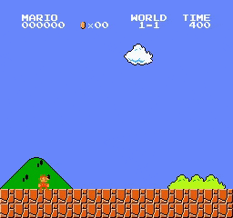
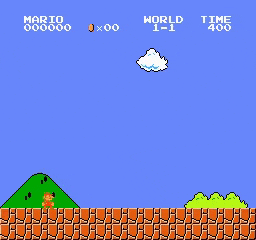
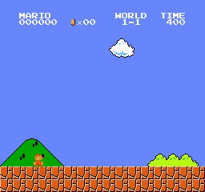

# Mario-DQN-Agent

Pytorch implementation of Deep Q-Network to play the classic Mario-Bros. 

- Train DQN from scratch or resume training, checkout [Getting Started](#how-to-use).

- Some pertained models are available for test, checkout [Playing Mario with Trained Network](#play-mario-with-dqn)

- Check out some [Demo Play](#demo)






***Note: I'll add some better trained models by 15th Nov 2019***
# How to Use
## Train
Train from scratch with default params.

```
$ python train.py
```
To resume traininng from a checkpoint, just give path to policy or target network

```
$ python train.py --policyNet PATH_TO_POLICY_NET
```

### Training Parameters

```
- policyNet=None; 		Path to pretrained/checkpoint of Policy network file. If not provided, training will start from scratch
- targetNet=None; 		Path to pretrained/checkpoint of Target network file. If not provided, training will start from scratch.
- batch_size=128; 		Batch Size for DQN training
- gamma=0.009; 			Gamma Value for Q-learning
- eps_start=0.9; 		EPS_START Value for Q-learning
- eps_end=0.05;			EPS_END value for Q-learning
- eps_decay=200; 		EPSE_DECAY value for Q-learning
- num_episodes=50; 		Number of Episodes for training
- target_update=10; 	Sync Target and Policy net every n epoisod
- ngpu=1; 				Number of GPUs to use
- save_every=5; 		Make a checkpoint after each n epochs
- output_targetNet='checkpoints/targetNet.pth'; Path where Target model will be saved/checkpoint
- output_policyNet='checkpoints/policyNet.pth'; Path where Policy model will be saved/checkpoint
```

## Play Mario with DQN

Play with randomly initialize DQN

```
$ python play.py
```
Play with Trained DQN

```
$ python play.py --targetNet PATH_TO_TARGET_NET
```
                        
### Parameters

``` 
- targetNet =None; Path to pretrained/checkpoint of target network file which will be used to play Mario.
```


# Demo
Followings are different models trained with different Hyper Params playing Mario

Episode 10


Episode 30


Episode 50


Episode 60


 